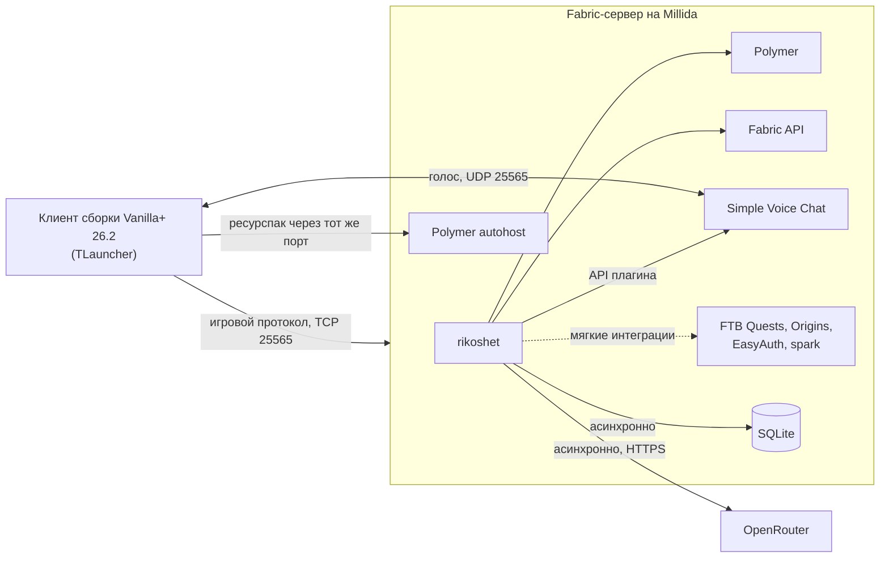
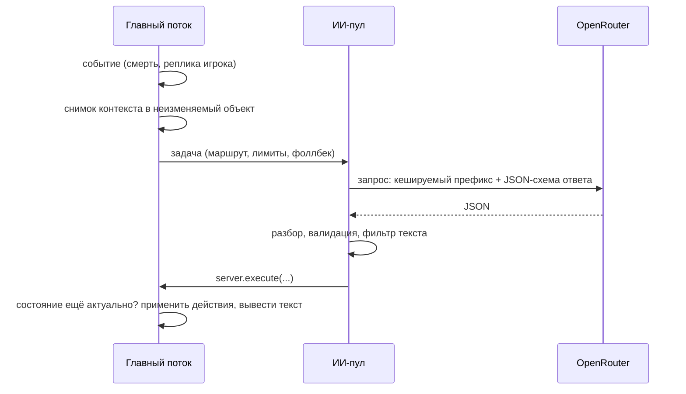

# Архитектура: обзор

> **Статус:** проработка · **Этап:** 1

## Контекст

Клиентская часть «Рикошета» не нужна: игрок видит ванильные и Polymer-предметы с моделями из ресурспака, манекены со скинами, текст в чате и слышит голоса через уже установленный голосовой чат. Вся логика живёт на сервере. Как мод уживается с остальными модами сборки — в [server-integration](server-integration.md).

## Модули

Рабочая раскладка пакетов. Каждый модуль выключается фичефлагом, если это возможно.

| Модуль | Отвечает за | Документ |
|---|---|---|
| `core` | инициализация, конфиг, фичефлаги, планировщик задач по тикам | [configuration](../ops/configuration.md) |
| `ai` | маршруты, промпты, очередь, лимиты, бюджет, разбор ответа, фоллбеки | [ai-integration](ai-integration.md) |
| `ai.action` | исполнение действий из белого списка | [ai-actions](ai-actions.md) |
| `voice` | озвучка реплик и голосовой ввод через Simple Voice Chat | [voice](../design/voice.md) |
| `integration` | мягкие интеграции: FTB Quests, Origins, EasyAuth, spark, Carry On | [server-integration](server-integration.md) |
| `persona` | персонажи, их промпты, память, репутация | [characters](../design/characters/README.md) |
| `storage` | БД, миграции, репозитории | [storage](storage.md) |
| `content` | предметы, блоки, сущности через Polymer; ресурспак | [content-delivery](content-delivery.md) |
| `world` | хаб, измерения, структуры, реестр изменений, откат | [worlds](worlds.md) |
| `flavor` | реакции на смерть и вход, газета, MOTD, таблист, дневники | [flavor](../design/flavor.md) |
| `quest` | квесты и ежедневные эксперименты | [quests](../design/quests.md) |
| `economy` | шмекели, торговец | [economy](../design/economy.md) |
| `event` | движок ивентов и мини-событий | [events](../design/events/README.md) |
| `command` | команды игроков и админов | [commands](../ops/commands.md) |

## Потоки выполнения

Главное правило: **мир трогаем только из главного потока сервера.** Всё медленное уходит в фон, результат возвращается через `server.execute(...)`.

| Поток | Что в нём происходит |
|---|---|
| Главный (тик сервера) | события игры, снимок контекста, применение действий, вывод текста |
| ИИ-пул (2–4 потока) | HTTP-запросы к OpenRouter, разбор и валидация JSON |
| Аудио (1 поток) | декодирование и кодирование Opus, ресемплинг, WAV; потоки голосового чата не блокируем |
| БД (1 поток-писатель) | все записи в БД по очереди; чтения тоже здесь, чтобы не блокировать тик |
| Планировщик батчей | ночная генерация пулов и газеты |

### Путь ИИ-запроса

Правила:

- В фон уходит только снимок данных (игрок, координаты, статистика), а не ссылки на `ServerPlayer`, `Level` или сущности.
- Перед применением результат перепроверяется: игрок мог выйти, умереть или уйти далеко.
- У каждого запроса есть таймаут и фоллбек. Нет ответа — выводим заготовку или молчим, а не ждём.
- Очередь ограничена. При перегрузе низкоприоритетные задачи (флейвор) выбрасываются, диалоги остаются.

## Отказоустойчивость

| Что сломалось | Что происходит |
|---|---|
| Нет ключа API | ИИ-функции работают на пулах заготовок, диалоги отвечают заглушкой |
| API недоступно или 5xx | до 2 повторов с паузой, затем фоллбек |
| Модель упала или упёрлась в лимит | OpenRouter переключается на запасную модель маршрута |
| Кончился дневной бюджет | живые запросы выключаются до полуночи, остаются пулы |
| Все модели маршрута отказались отвечать | реплика-заглушка в образе персонажа |
| Нет голосового чата или озвучка не успела | только текст |
| Нет FTB Quests, Origins или EasyAuth | соответствующая интеграция выключена, остальное работает |
| Ответ не прошёл валидацию | текст выводим, если он безопасен; недопустимые действия отбрасываем и пишем в лог |
| БД недоступна | мод логирует ошибку и выключает фичи, которым нужна БД; игра продолжается |

## Ключевые решения

- [ADR 0001](../adr/0001-server-side-only.md) — только серверный мод, Polymer
- [ADR 0002](../adr/0002-minecraft-26-2.md) — Minecraft 26.2, Mojang-имена
- [ADR 0003](../adr/0003-ai-provider-and-protocol.md) — ИИ-провайдер и JSON-протокол
- [ADR 0004](../adr/0004-storage-sqlite.md) — SQLite
- [ADR 0005](../adr/0005-events-in-separate-worlds.md) — ивенты в отдельных мирах
