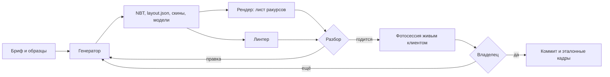

# Визуальный конвейер: генерация, рендер, проверка

> **Статус:** в разработке: каталог, рендер, линтер, генератор, образцы с разметкой готовы · **Этап:** 3.5 · **Решение:** [ADR 0008](../adr/0008-visual-pipeline.md) · **Зависит от:** [content-delivery](content-delivery.md), [worlds](worlds.md#цитадель)

Инструменты для построек, скинов, моделей и эффектов «Рикошета». Задача — видеть результат до захода в игру. Что рисовать для Цитадели — в [дорожной карте](../roadmap.md#этап-35--цитадель-эффектно) и брифе этапа 3.5. Какие приёмы вообще доступны без клиентского мода — в [content-delivery](content-delivery.md#приёмы-ванильного-клиента).

## Зачем

На этапе 3 лабораторию и скин Рика писали вслепую. Скрипт ставит блоки по координатам, а как это выглядит, видно только в игре: сборка мода, копия сервера, живой клиент. Одна итерация занимает минуты, и оценить результат может только человек за клиентом. Отсюда и простота: плоская площадка 27×31, лаборатория-коробка, скин без объёма.

Цель — замкнутый цикл: сгенерировал, за секунды увидел все ракурсы, поправил. Живой клиент нужен только для приёмки.

## Что уже есть под рукой

Проверено 2026-09-29.

| Что | Где | Сколько |
|---|---|---|
| Клиент Minecraft 26.2: текстуры, модели, blockstates, шрифты, описания предметов | кеш Loom (`~/.gradle/caches/fabric-loom/26.2/minecraft-client.jar`); если его нет — `tools/mc` сам качает клиент по манифесту Mojang со сверкой sha1 в `run/visual/cache/` (39 МБ) | 1269 текстур блоков, 2657 моделей блоков, 1199 blockstates, 1537 описаний предметов, 102 анимированные текстуры блоков |
| Ассеты модов сборки | `~/common/projects/mc-fabric-26.2/server/mods/` | blockstates: BetterEnd — 733, BetterNether — 681, Macaw's Doors — 268, Voxelized Furniture — 167, Farmer's Delight — 134 |
| Готовые постройки — структуры NBT | те же jar | ванила — 1212, Terralith — 173, BetterEnd — 128, BetterNether — 108, Farmer's Delight — 5 |
| Python 3.11, Pillow, numpy; scipy — для сегментации образцов | машина разработчика | Blender, ffmpeg и moderngl не установлены |
| Генератор скинов, превью Джерри | `tools/skins`, `~/common/projects/mc-fabric-26.2/skins/` | — |
| Клиентская сборка игроков | `~/common/projects/mc-fabric-26.2/client/mods/` | в ней Sodium и Iris: у кого-то из игроков может быть включён шейдер |

Для рендера с настоящими текстурами, включая модовые блоки, качать ничего не нужно. Чужие миры и моды с постройками для образцов качаются отдельно, по бюджету трафика ([ниже](#библиотека-образцов-toolsrefs)).

## Цикл



- **Лист ракурсов** — все виды на одной картинке шириной до ~1600 px. Его за один раз разбирает и человек, и ассистент: Claude читает PNG сам.
- **Линтер** ловит то, чего не видно на картинке: чужие id, отваливающиеся блоки, тёмные углы, непроходимые места, превышение бюджетов.
- **Фотосессия** — кадры из настоящего клиента с модами сборки: манекены, частицы, туман, пак. Она занимает минуты, поэтому только перед приёмкой.
- **Решает владелец** — по 2–3 вариантам рядом, а не по одному.

## Состав

| Инструмент | Папка | Что делает |
|---|---|---|
| Общая библиотека | `tools/mc/` ✓ | NBT и форматы построек, ассеты слоями как в игре, модели блоков ([README](../../tools/mc/README.md)) |
| Каталог блоков | `tools/mc/data/registry-26.2.json` ✓ | дамп реестров с копии сервера: блоки со свойствами и тегами, предметы, частицы, звуки |
| Рендер | `tools/render.py` ✓ | изометрия, план, срезы, разрез, перспектива, свет как в игре, манекены, лист; диф — позже |
| Генератор построек | `tools/build/` ✓ | формы SDF со сглаживанием, кисти и узоры, префабы, соединения, `layout.json`, свет; слои ручных правок и куски — позже ([README](../../tools/build/README.md)) |
| Линтер построек | `tools/lint.py` ✓ | проверки и бюджеты |
| Скины | `tools/skins/` | skinlib 2, линтер, эмоции; лист рендера скина — ✓ в `tools/render.py` |
| Библиотека образцов | `tools/refs.py`, `tools/refs/` ✓ | источники с рейтингом, постройки из миров, разметка по типу, стилю и зоне, доски зон, палитры, сочетания, мотивы; фасады — позже |
| Модели и эффекты | `tools/models/`, `tools/fx/` | модели из вокселей, анимированные текстуры, портал, звуки, постеры |
| Фотосессия | `tools/shoot/`, `testserver.sh shoot` | dev-клиент с модами сборки делает кадры по списку |

Всё на Python 3.11 с Pillow и numpy (для образцов ещё scipy), кроме фотосессии (Gradle и Java). Выходы, которые не идут в мод, складываются в `run/visual/` — он в `.gitignore`.

## Что готово

2026-09-29, первый шаг этапа 3.5.

- **Дамп реестров** `/rickdev dump registry`: 3158 блоков (96 617 состояний), 3736 предметов, 1628 структур, 129 модов. Файл — 1,5 МБ в git.
- **Рендер**: лист лаборатории — восемь ракурсов и вид глазами игрока — за 3–7 с в зависимости от загрузки машины; один вид — за 0,7 с, лист скина — за 0,4 с. Модели Voxelized Furniture и BetterEnd рисуются своими текстурами из jar модов. Ориентация граней скина сверена с независимым превью Джерри из сборки.
- **Линтер** на лаборатории этапа 3 нашёл настоящую ошибку: блока `polished_andesite_wall` в игре нет, и столбы фонарей на площади были воздухом. Исправлено на `andesite_wall`.
- **Образцы**: индекс всех 1627 структур из jar — за 8 с. Галерея категории из 24 миниатюр — за 6 с; закрытые постройки, например испытательные камеры, показываются разрезом.

Второй шаг, тот же день:

- **Генератор** `tools/build`: сцена, формы SDF, сглаживание ступенями и плитами, оболочки без дыр, кисти, префабы с поворотом состояний, соединения как у игры, невидимый свет. Лаборатория этапа 3 перенесена сценой — файл совпадает байт в байт. Демо-сцена (два купола, кольцо, труба, фонари по кругу) собирается за 0,2 с.
- **Образцы из миров**: 35 035 образцов в индексе — jar сборки, 23 мода с Modrinth, Hermitcraft 6–10, Empires SMP 2, Dream SMP, Greenfield, Uncensored Library, Future City, TerraCitee, киберпанк-города. Трафик — около 29,5 ГБ, на диске после скана — 0,8 ГБ. Постройки вырезаются из миров автоматически, а крупная застройка режется на отдельные здания.
- **Разметка** по типу, стилю, масштабу, среде и зоне Цитадели: слова в id, геометрия, модель стиля (66% на отложенных по всем стилям, кроме деревни, против 30% у правил), 278 ручных меток по листам. Доски всех 11 зон выгружены палитрами в `tools/build/palettes/`. Лучшие образцы для sci-fi-зон — из Future City и TerraCitee: летающие корабли, парящие станции, посадочные площадки, краны космопорта, неоновые кварталы.

Дальше: разметить лучшее для зон Цитадели, доски зон; skinlib 2; фотосессия.

## Общая библиотека `tools/mc`

**Ассеты слоями** — в том же порядке, что у клиента: наш пак (`src/main/resources/assets`), потом jar модов сборки, потом клиент 26.2 из кеша Loom. Распакованное лежит в `run/visual/cache/` с ключом по sha1 jar из `manifest.json` сборки. Если клиентского jar в кеше нет — `./gradlew genSources` или загрузка по манифесту версий Mojang. Jar и текстуры Mojang в git не кладём.

**Модели блоков.** Blockstates (`variants`, `multipart` с `when`), цепочка `parent`, переменные текстур, элементы с поворотом и `rescale`, грани с `uv`, `rotation`, `cullface`, `tintindex`. Трава, листва и вода тонируются цветами биома `citadel`. Анимированные текстуры — первым кадром, для GIF — все кадры. Блоки с `builtin/entity` (сундуки, кровати, таблички, головы, горшки) — упрощённые модели по текстурам из `textures/entity/`. Модели, которых нет в jar (BCLib часть строит на лету), — заглушкой цвета карты, с пометкой в отчёте.

**Форматы построек:** структура NBT (своя и из jar), `.schem` (Sponge v2/v3), `.litematic`, регионы `.mca` с 1.18. Всё приводится к одному объёму: массив индексов палитры (numpy), палитра, блок-сущности, сущности.

**Каталог блоков.** Источник правды — работающий сервер, а не память и не вики ([правило](server-integration.md#что-это-значит-для-мода)). Команда `/rickdev dump registry` на копии сервера пишет JSON. Для каждого блока там мод, свойства со значениями, состояние по умолчанию, теги, свет, падает ли блок, полный ли он куб, есть ли у него блок-сущность, цвет на карте (`MapColor`). Кроме блоков — id предметов, типов частиц, звуков, сущностей. Файл лежит в git и пересобирается, когда меняется `manifest.json` сборки. Поверх дампа библиотека считает по текстурам средний цвет граней, пёстрость и прозрачность — чтобы подбирать блоки по цвету.

## Рендер

```sh
python3 tools/render.py structure.nbt                # все ракурсы → run/visual/<имя>/sheet.png
python3 tools/render.py structure.nbt --views iso_se,top,eye:spawn --light game
python3 tools/render.py structure.nbt --slices       # планы этажей
python3 tools/render.py skin.png                     # лист скина
```

Программный растеризатор на numpy. Грани моделей рисуются текстурированными четырёхугольниками с буфером глубины, закрытые грани отсекаются по `cullface`. Прозрачное (стекло, вода) рисуется после непрозрачного, от дальнего к ближнему.

| Вид | Что показывает |
|---|---|
| `iso` | изометрия с четырёх углов, 16 px на блок |
| `top` | план сверху; `top --map` — цветами карты, как постройку увидят на миникарте Xaero |
| `front`, `side` | фасады |
| `slices` | план каждого этажа с сеткой и координатами — для ручной правки в креативе |
| `cut` | разрез: всё выше `y` скрыто, виден интерьер |
| `eye:<точка>` | перспектива с любой точки: высота глаз, FOV 70 — «что видит игрок, выйдя из портала» |
| `turntable` | GIF-облёт по 8 углам |
| `diff` | добавленное зелёным, убранное красным, изменённое жёлтым, плюс сводка по блокам |

**Свет.** `flat` — только затенение граней, как в игре: верх 1,0, север и юг 0,8, запад и восток 0,6, низ 0,5. `game` — блочный свет заливкой от светящихся блоков плюс небо измерения: видно, что под тёмным небом End в Цитадели останется в тени. `ao` — мягкие тени в углах, как при сглаженном освещении.

**Сущности.** Рамки с картами и предметами, display-декор из `layout.json` (матрица трансформации, `brightness`), `text_display` шрифтом клиента, манекены на точках — скином из пака. На рендере лаборатории Рик стоит там же, где встанет в игре.

Чего рендер не умеет и уметь не будет: частицы, погода, шейдеры, анимации сущностей, отличия Sodium. Это смотрим фотосессией.

Цель по скорости: лаборатория этапа 3 (27×12×31) — лист за ≤ 5 с, объём 128×64×128 — за ≤ 60 с.

## Генератор построек `tools/build`

Заменил `tools/citadel/build.py`: вместо `put` и `box` по координатам — сцена с формами, кистями и префабами ([README](../../tools/build/README.md)). Лаборатория этапа 3 перенесена сценой `citadel/lab`, файл совпадает со старым байт в байт.

```python
from build import Scene, brush, shape

def build():
    s = Scene("citadel/plaza", size=(96, 40, 96), seed=26)
    hull = brush.gradient(["white_concrete", "calcite", "quartz_block"], axis="y", noise=0.15)
    s.fill(shape.cylinder((48, 0, 48), r=40, h=2) - shape.cylinder((48, 0, 48), r=6, h=2), hull, smooth=True)
    s.fill(shape.sphere((48, 2, 48), 14).cut(y0=2), brush.edges(hull, "iron_block"), smooth=True, hollow=1)
    s.fill(shape.arch((48, 2, 62), width=5, height=6, depth=4), "air")
    s.radial(8, lambda f: f.prefab(lamp_post, at=(0, 2, 34), facing="north"), center=(48, 48))
    s.fill(shape.pipe([(10, 3, 10), (20, 9, 14), (30, 9, 30)], 0.9), brush.glass_tube("lime"))
    s.marker("rick", (48, 2, 44), "south")
    s.display("rikoshet:citadel/space_cruiser", (40, 26, 20), scale=3, yaw=30)   # → layout.json
    s.lights(target=11)        # невидимые блоки light там, где на полу темнее 11
    return s                   # python3 tools/build citadel/plaza: NBT, лист рендера, отчёт линтера
```

- **Формы — функции расстояния (SDF)** на numpy: коробка, сфера, эллипсоид, цилиндр, конус, тор, капсула, труба по ломаной, арка, выдавленный многоугольник. Их можно объединять, вычитать, пересекать, сливать мягко, превращать в стенку, резать плоскостью, поворачивать вокруг вертикали.
- **Сглаживание** (`smooth=True`). Центр клетки внутри формы — полный блок. Снаружи, где форма задевает клетку, ставится ступень или плита по восьми подвыборкам. Центроид занятых подвыборок смотрит вниз — плита; вбок и вниз — ступень высокой частью в гору; вбок и вверх — перевёрнутая ступень. У материала нет ступеней — блок остаётся кубом. Этим красивый купол и отличается от «пиксельного».
- **Оболочка без дыр** (`hollow=N`) — N слоёв клеток у поверхности по 6-соседству. Тонкая SDF-стенка (`shell`) может не задеть центр клетки, и сквозь купол видно небо.
- **Кисти** — чем заливать: сплошная, смесь по весам (солью или пятнами), градиент по оси, радиусу или глубине, 3D-шум, узор плиткой, по нормали (сверху плиты, по бокам полный блок), обводка настоящих рёбер (по лапласиану SDF, а не по ступенчатости вокселей), ярусы, «грибли» — редкие детали по открытым граням. Ряд блоков по цвету — `brush.ramp("#e8f4f8", "#7fa6b5")` через средний цвет текстур в CIELAB. Палитра зоны из образцов — `brush.from_palette("lab", "middle")`.
- **Состояния с учётом поворота.** Поворот и отражение префаба меняют `facing`, `axis`, `rotation`, `orientation`, стороны заборов, петли дверей и половинки сундуков — как `StructureTemplate`. Ступени, заборы, стены, панели и решётки соединяются ещё в генераторе, как `updateShape`: игра при установке структуры внутри неё формы не пересчитывает. Свойства, равные умолчанию, не пишутся.
- **Префабы** — функция на Python (рисует «лицом на юг», рамка поворачивает), NBT из `tools/build/prefabs/` или чужая структура по id. Чужие структуры в наш NBT не копируются: в `layout.json` пишется «поставь здесь `minecraft:…`», и мод берёт её из jar игры. `radial` расставляет префабы по кругу под любым углом, состояния — к ближайшим 90°.
- **Детерминизм.** Шум — от `seed` и позиции, блоки пишутся по (y, z, x), палитра — в порядке первого применения, gzip без времени. Тот же код даёт тот же файл байт в байт.
- **Пока нет:**
  - **Слои ручных правок.** Допустим, админ перестроил что-то в креативе и сохранил через `/rickadmin citadel save`. Тогда `build pull` должен забирать NBT, считать отличие от сгенерированного и класть его оверлеем в `tools/build/overlays/`.
  - **Куски большой постройки** с общей сеткой ([worlds](worlds.md#структуры)).
  - **Чтение `layout.json` модом** — установка кусков порциями по тикам и display-декор виртуальными сущностями Polymer ([ADR 0008](../adr/0008-visual-pipeline.md)).

## Линтер

| Проверка | Уровень |
|---|---|
| id блока и значения свойств есть в каталоге | ошибка |
| блок из мода, которого нет на сервере | ошибка |
| падающие блоки без опоры: песок, гравий, бетонный порошок, наковальни | ошибка |
| блоки, которые отвалятся: факелы, кнопки, ковры, цветы, фонари без опоры | ошибка |
| точки `rick`, `spawn`, `portal_back` есть, каждая по одной, над опорой два блока воздуха | ошибка |
| от `spawn` до Рика, портала, торговца и аркад есть путь шириной от 2 блоков, без уступов выше блока | ошибка |
| бюджеты: блоки, блок-сущности, display-декор, размер NBT ([ниже](#бюджеты-цитадели)) | ошибка |
| доля пола, где в `game`-свете темнее 7 | предупреждение и карта тёмных мест |
| потолок ниже 3 блоков в помещении | предупреждение |
| «скучная стена»: плоский участок из одного блока больше 6×6 | предупреждение с координатами |
| несущие поверхности из модовых блоков: если мод уберут, останутся дыры | предупреждение |
| больше 40 разных блоков в одной зоне — пестрит | предупреждение |

Отчёт выходит текстом и картинкой — планом с отметками проблем.

## Скины `tools/skins`

**skinlib 2** — поверх нынешней раскладки:

- **Рампы с тоновым сдвигом.** Из базового цвета — 4–5 тонов: тени уходят в холодное, блики в тёплое. Так рисуют хорошие пиксельные скины, а простое затемнение к чёрному даёт грязь.
- **Автообъём.** Скин размечается областями (халат, рубашка, брюки, кожа), освещение накладывается отдельным проходом. Верхние грани светлее, нижние и внутренние темнее, рукава и штанины темнеют книзу, под головой и в подмышках тень. Руками добавляются только акценты.
- **Фактуры** — редкий шум ткани, швы, складки, пуговицы, карманы — ставятся штампами.
- **Лицо из деталей**: глаза, бровь, нос, рот, слюна — по координатам. Эмоция — другой набор деталей: `neutral`, `smug`, `angry`, `drunk`, `shocked`.
- **Внешний слой для объёма**: волосы, воротник, очки, полы халата. Проверяется, что внешний слой не висит в воздухе.
- **Лист персонажа** в `<id>.py`. В нём палитра с образцов — пипеткой или k-means по картинке; сами картинки держим локально, не в git. Там же — что должно узнаваться («сплошная бровь, торчащие голубоватые волосы, слюна, халат до колен») и список эмоций.

**Рендер скина** — лист вроде превью Джерри, но полнее:

- три четверти спереди и сзади, фас, спина, бока, макушка;
- развёртка с сеткой;
- строка эмоций;
- вид с 4, 8, 16 и 32 блоков — уменьшено до размера на экране 1080p;
- рядом образец, если он дан.

Свет — как у сущностей в игре, вариант `dark` — в тени Цитадели.

**Линтер скина:**

- базовый слой непрозрачен: скачанные скины игра сама делает непрозрачными, а текстуры из пака, похоже, нет — проверить спайком;
- во внешнем слое альфа только 0 или 255;
- ничего вне развёртки;
- глаза читаются на фоне кожи с 8 блоков.

**Сверх текстуры** — проверить спайком, приёмы — в [content-delivery](content-delivery.md#приёмы-ванильного-клиента):

- **Объёмная причёска.** Предмет с моделью из пака в слоте головы манекена — торчащие пряди Рика настоящей 3D-моделью, а не одним слоем пикселей.
- **Эмоции.** Несколько текстур на персонажа; код меняет `profile.texture` манекена по настроению в чате и репутации игрока.
- **HD-скин** — текстура 128×128 вместо 64×64. UV модели нормированы, поэтому клиент может принять и крупную текстуру. Если покажет — выбор за владельцем ([№ 32](../open-questions.md#открытые)).

## Библиотека образцов `tools/refs`

Где подсмотреть, как строят красиво: сочетания материалов, пропорции, детали. Образцы нужны для изучения. В мод и git чужие постройки не попадают, загрузчик префабов их не принимает. В git идёт только выведенная статистика — палитры зон в `tools/build/palettes/`.

```sh
python3 tools/refs.py sources                        # источники, что скачано, остаток бюджета трафика
python3 tools/refs.py scan all                       # все миры из sources.json по очереди → run/refs/worlds/
python3 tools/refs.py modrinth --top 24 && python3 tools/refs.py fetch modrinth
python3 tools/refs.py index                          # всё вместе: размеры, палитры, оценка, метки
python3 tools/refs.py review greenfield: --todo      # лист с номерами для ручной разметки
python3 tools/refs.py label 5 type=hall style=futuristic zones=council rating=5 note="…"
python3 tools/refs.py gallery --zone lab --limit 48  # лучшее для зоны; также --type --style --scale --env
python3 tools/refs.py board lab --export             # доска зоны → палитра, ярусы, сочетания, мотивы
python3 tools/refs.py check                          # точность разметки стиля
```

### Источники

Реестр — [tools/refs/sources.json](../../tools/refs/sources.json): для каждого источника — что там, ссылка, рейтинг, условия, стили. Скачанное — в `run/refs/`, бюджет трафика — в том же файле.

| Источник | Что | Как берём |
|---|---|---|
| jar сборки | около 1600 структур: ванила, Terralith, BetterEnd, BetterNether | уже на диске |
| Modrinth | 23 самых скачиваемых мода и датапака с постройками (Dungeons and Taverns, Repurposed Structures, CTOV, When Dungeons Arise, Towns and Towers, Moog's, Incendium, Luki's Grand Capitals…) — около 16 тысяч структур | открытый API, jar целиком |
| Hermitcraft, сезоны 6–10 | выживание команды известных строителей: базы, район магазинов, мегапроекты | официальные архивы, чтение по частям |
| Greenfield | город в натуральную величину: небоскрёбы, фасады, улицы | MediaFire режет чтение по частям — архив целиком, после скана удаляется |
| Empires SMP 2, Uncensored Library, Dream SMP | империи в разных стилях; неоклассика Blockworks; знаменитый сюжетный сервер | archive.org, чтение по частям |
| Planet Minecraft, CurseForge, minecraftmaps | лучшие по оценкам игроков: футуризм, киберпанк, корабли | закрыты Cloudflare — владелец качает браузером в `run/refs/inbox/` (zip, rar, `.schem`, `.litematic`, `.nbt`), `refs.py inbox` подхватывает. Уже взяты: Future City 5.5, TerraCitee (1.12.2), два киберпанк-города MegaMinerDL, корабль |

### Постройки из миров

1. **Скан** (`scan`). Архив мира читается по HTTP Range: оглавление zip, потом только регионы, без `entities/` и `poi/`. Прочитанное пишется в `heat.jsonl`, так что оборванный скан продолжается с места остановки. Формат регионов — с 1.13 (до 1.18 и после). Старые id и свойства приводятся к 26.2 таблицей переименований (`grass` → `short_grass`, `chain` → `iron_chain`, стены `true/false` → `low/none`). Для каждого чанка считается, сколько в нём рукотворного по секциям. Секции без рукотворного в палитре не распаковываются, поэтому скан упирается в сеть, а не в процессор. Постройки, сгенерированные игрой (деревни, шахты, крепости), вычитаются по рамкам их частей из NBT чанков. Регионы с застройкой кешируются и после вырезки удаляются.
2. **Кластеры** застроенных чанков режутся на плитки 6×6 чанков.
3. **Сегментация** (`segment`). Плитки кластера собираются обратно, рукотворное считается на сетке 4×4×4. Каждая связная масса становится своей постройкой: дом на поверхности отделяется от фермы под ним. Слишком широкая масса режется заново с порогом плотности выше. Первыми рвутся редкие связи — дороги, мосты, туннели.
4. Что рукотворное — по тому же правилу, что у мода ([builds](../design/builds.md#что-рукотворное)), порт — `tools/mc/kinds.py`.
5. **Городской режим** (`"segment": "city"` в `sources.json`). Под городскими картами лежит искусственная «земля» из бетона и шерсти, и без него весь город — одна масса. В этом режиме здание — это рукотворное выше поверхности колонки (первый воздух над основанием). Плоские колонны высотой до 4 блоков — дороги и тротуары — в связность не идут ни в каком режиме. При пересегментации ручные метки переезжают на сегмент с наибольшим перекрытием рамок.
6. **Миры до 1.13** (числовые id) читаются по таблице `tools/mc/data/legacy-1.12.json` (PrismarineJS/minecraft-data, MIT): `Blocks`, `Add` и `Data` → состояние 1.13 → переименования до 26.2.

Замеры 2026-09-29, канал около 2,4 МБ/с:

| Мир | Что вышло | Время |
|---|---|---|
| Hermitcraft 10 (1.21.8, 1,02 ГБ регионов) | 576 плиток, 819 построек | скан около 17 мин |
| Hermitcraft 9 (1.20, 1,9 ГБ) | 709 плиток, 952 постройки | скан 25 мин |
| Hermitcraft 8 (1.17.1, формат до 1.18, 1,09 ГБ) | 305 плиток, 433 постройки | скан 10 мин |
| Hermitcraft 7 (1.16.4) | 882 плитки, 1312 построек | продолжен после сбоя с 496-го региона из 639 — докачано 0,41 ГБ |
| Hermitcraft 6 (1.14.4, 2,04 ГБ) | 766 плиток, 1131 постройка | 13 мин |
| Empires SMP 2 (1.19.1, 3,49 ГБ) | 652 плитки, 990 построек | 43 мин |
| Dream SMP (1.16–1.18, 6251 регион, 16,25 ГБ) | 2290 плиток, 3210 построек | 5,2 ч при 0,9 МБ/с |

| Future City 5.5 (1.21, из «входящих») | 610 плиток, 1011 построек | 48 с |
| TerraCitee (1.12.2, числовые id, rar) | 517 плиток, 390 построек в городском режиме | 18 с |

Неизвестных блоков после таблицы переименований нет ни в одном мире — версии от 1.12 до 1.21.
| Uncensored Library (1.15) | 121 постройка | 1,5 мин |
| Greenfield (1.14, 1,2 ГБ) | 3826 плиток, 7424 постройки | скан 3 мин после загрузки; сегментация — 2,8 мин и 2,9 ГБ памяти |

### Темы, типы, стили

Разметка по осям — [tools/refs/taxonomy.json](../../tools/refs/taxonomy.json), код — `tools/mc/classify.py`.

| Ось | Значения |
|---|---|
| Тип | дом, башня, замок, храм, зал, лавка, мастерская, ферма, склад, мост, стена, площадь, улица, корабль, статуя, подземелье, руины, портал, установка, малая форма, интерьер |
| Стиль | средневековье, фэнтези, органика, восток, север, деревня, пустыня, готика, неоклассика, модерн, футуризм, sci-fi, киберпанк, стимпанк, индустриальный, руины, Незер, Энд, океан |
| Масштаб | деталь, комната, здание, комплекс, квартал |
| Среда | на земле, под землёй, в воздухе, в воде, Незер, Энд |
| Зона Цитадели | лаборатория, площадь, зал Совета, бар, аркады, лавки, нижние ярусы, доки, портальная зона, гараж Смитов, задник |
| Качество | оценка по рукотворному: объём, доля деталей (ступени, плиты, заборы), разнообразие материалов, свет; ручная — 1–5 |

Откуда метки, по убыванию доверия:

1. **Ручные** — `tools/refs/labels.json` в git, ставятся по листам `review` командой `label`. Они главнее всего остального.
2. **Слова в id** — у структур из jar: `village/desert/…`, `castle`, `tower`.
3. **Геометрия** — высота к основанию, закрытый объём (помещения), опора на землю, крыша из рельефа, доля фермы, редстоуна, склада.
4. **Модель стиля по материалам** — softmax-регрессия по долям семейств материалов (`kinds.family`: ступени, плиты и отделка одного камня — один материал). Учится на структурах, где стиль известен по id, и на ручных метках. На отложенных примерах (2026-09-30):
   - все стили, кроме деревни, — 66% верных против 30% у правил по материалам; после 278 ручных меток футуризм (80%), киберпанк (75%) и модерн (83%) стали обучаемыми стилями;
   - деревня — 5%: у неё с средневековьем и севером одни и те же дуб, ель и булыжник, а половина деревень CTOV и выглядит средневеково. С деревней вместе — 40%.
   
   Стили, для которых примеров меньше 15 (sci-fi, стимпанк, органика), пока решают подписи материалов. Для стилей, которых в id почти нет (модерн, футуризм, sci-fi, киберпанк), работают подписи материалов из `taxonomy.json`, пока ручных меток не станет больше 15 на стиль.

**Зоны.** У каждой зоны Цитадели в `taxonomy.json` есть веса стилей и типов и признак «нужен интерьер». Пригодность образца для зоны — совпадение стиля × совпадение типа × качество. `gallery --zone lab` показывает лучшее для лаборатории, а `board lab` собирает доску.

**Доска зоны** (`board`) — мост от образцов к генератору. Лучшие образцы зоны → лист, палитра ярусов (низ, середина, верх), сочетания материалов, мотивы 3×3×3. С `--export` палитра и сочетания пишутся в `tools/build/palettes/<зона>.json` (в git). Генератор берёт их через `brush.from_palette`.

### Разбор

| Разбор | Выход |
|---|---|
| Палитра | доли блоков и образцы текстур — карточка палитры |
| Стили | группы построек по материалам (k-means) с лучшими примерами — `styles` |
| Сочетания | пары материалов, которые кладут вплотную чаще случайного (lift): чем что обводят |
| Ярусы | из чего низ, середина и верх — готовые смеси для кистей |
| Мотивы | частые куски 3×3×3 с учётом поворота и отражения, встречающиеся в разных постройках: узоры полов, карнизы, перила |
| Фасады | профиль стены по глубине, шаг окон — позже |

**Галерея** — `run/visual/refs/index.html`: миниатюры с фильтром по id, источнику, стилю и блоку, сортировка по оценке.

## Модели и эффекты `tools/models`, `tools/fx`

- **Модели из вокселей.** Вещь лепится той же сценой `build`, что и постройки: корабль Рика 32×16×20, пульт, колба. Потом запекается в одну модель предмета: воксели сливаются в элементы, собирается атлас текстуры, пишется `assets/rikoshet/items/<id>.json` в формате 26.2. Показывает её `item_display` в любом масштабе — одна сущность вместо сотен блоков. Генератор соблюдает пределы модели Java: элементы — в кубе от −16 до 32, повороты ограничены. Бюджет — до 200 элементов на модель. Для ручной лепки остаётся Blockbench, и его JSON рендер читает так же.
- **Портал.** Анимированная текстура вихря — кадры 64×64, `.mcmeta` с интерполяцией — на плоской модели. `item_display` стоит в плоскости портала, светится на 15 и раскрывается за полсекунды интерполяцией масштаба. Кольцо частиц остаётся. Превью — GIF.
- **Звуки.** Синтез на numpy: открытие и закрытие портала, гул Цитадели петлёй, писк приборов, бульканье колб. Из WAV в OGG моно — нужен `oggenc` (`brew install vorbis-tools`). Звуки из сериала не берём.
- **Постеры.** Путей два. Плоская модель с текстурой из пака даёт чёткую картинку любого размера. Карта-картинка (map art) с дизерингом в палитру карт работает без пака и может рождаться на лету — например, первая полоса газеты на стене Цитадели. Превью показывает, как картинка ляжет.

## Фотосессия `tools/shoot`

Отдельный Gradle-проект только для машины разработчика. В мод и в клиентскую сборку он не входит, так что [ADR 0001](../adr/0001-server-side-only.md) не нарушается. Это Loom `runClient` с клиентскими модами сборки (включая Sodium) и маленьким клиентским модом-фотографом.

```sh
tools/testserver/testserver.sh shoot tools/shoot/citadel.json
```

1. На копии сервера ник фотографа добавляется в whitelist и op — только на копии.
2. Клиент заходит на `localhost:25565`, принимает пак, проходит EasyAuth тестовым паролем.
3. Для каждого кадра из списка: режим наблюдателя, `tp` в точку с поворотом, ожидание прогрузки чанков, снимок без HUD в 1920×1080 → `run/visual/shots/<кадр>.png`.
4. Серии кадров по 20 в секунду для портала и анимаций склеиваются в GIF.
5. В конце — лист кадров, клиент выходит.

Кадры снимаются с тех же точек, что и вид `eye:<точка>` рендера, так что рендер можно сверить с правдой. Раз у игроков есть Iris, приёмочные кадры повторяются с популярным шейдером — Цитадель не должна разваливаться и в нём.

Фотосессия пригодится и потом: гаджеты на этапе 4, персонажи на 5-м, ивенты на 7-м.

## Как сделать результат лучше

1. **Не коммитить вслепую.** Каждая генерация заканчивается листом рендера и отчётом линтера.
2. **Сначала бриф.** Для зоны: зачем она игроку, что должно узнаваться, палитра, 3–5 образцов. Для персонажа — лист персонажа. Без брифа генератор выдаёт «аккуратно, но никак».
3. **Три глубины на фасаде.** Колонны выступают, стена посередине, окна утоплены. Плоская стена из одного блока — только если так задумано; «скучные стены» ловит линтер.
4. **Кривые сглажены.** Купола и кольца — через SDF, со ступенями и плитами.
5. **Свет — часть дизайна.** Небо Цитадели тёмное, поэтому рендер — в `game`-свете, плюс скрытые блоки `light` и светящиеся display-модели.
6. **Детали рассказывают историю.** Реквизит из сериала по зонам: плюмбус, коробка Мисиксов, огурчик Рик в банке, масляный робот, сычуаньский соус, кресла Совета Риков, стойка портальных пушек. Бардак в лаборатории — нарочно.
7. **Масштаб — задником, а не блоками.** Играем на площадке 60×60, а вокруг в пустоте висят гигантские модули Цитадели и пролетают корабли — display-модели в масштабе ×50–200.
8. **Жизнь.** Вихрь портала, мерцание экранов, гул, редкий писк приборов — данными биома и анимированными текстурами. Движущиеся display — только пока в Цитадели есть игроки.
9. **Варианты рядом.** 2–3 варианта на одном листе; выбирает владелец.
10. **Оболочка из ванилы, детали из модов.** Мебель Voxelized Furniture, двери Macaw's, камни и светильники BetterEnd, кухня Farmer's Delight для бара — да. Но если мод пропадёт, должны исчезнуть детали, а не стены.
11. **Эталоны.** Принятые кадры фотосессии лежат в `docs/media/`, до 300 КБ на кадр. Когда меняется генератор, новый рендер сравнивается с принятым через `diff`.

## Бюджеты Цитадели

| Что | Предел |
|---|---|
| Блоков в кусках | до 300 000 |
| Блок-сущностей: таблички, головы, сундуки | до 300 |
| Display-декора | до 150 из общего ориентира 300–500 ([performance](performance.md#бюджет)) |
| Движущихся display | до 20; позиция обновляется раз в 1–2 с, плавность даёт интерполяция на клиенте |
| Ресурспак этапа 3.5: скины, модели, текстуры, звуки | до 8 МБ из 20 |
| Установка | порциями, на профиле вклад в тик не виден |

Линтер проверяет всё, кроме тика, а тик — `testserver.sh profile`.

## Открытые вопросы

- [№ 30–32](../open-questions.md#открытые): масштаб Цитадели, лаборатория — гараж или хай-тек, HD-скины.
