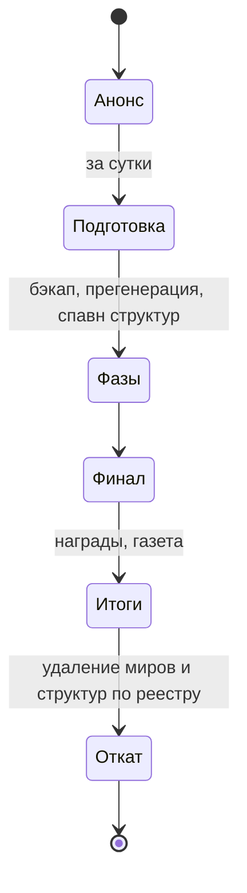

# Большие ивенты

> **Статус:** идея · **Этап:** 7 · **Зависит от:** [worlds](../../architecture/worlds.md), [performance](../../architecture/performance.md)

## Список

Порядок — порядок запуска: каждый следующий опирается на механики предыдущего.

| # | Ивент | Длительность | Где | Ключевая механика | Документ |
|---|---|---|---|---|---|
| 1 | Голова в небе | 1–3 дня | основной мир + участки | строительный конкурс, судит ИИ | [big-head](big-head.md) |
| 2 | Кроненберг-апокалипсис | вечер | копия мира | выживание против орд | [cronenberg-apocalypse](cronenberg-apocalypse.md) |
| 3 | Оккупация Федерации | 2–4 дня | основной мир + арена штурма | диверсии, налоги, финальный штурм | [federation-occupation](federation-occupation.md) |
| 4 | Выборы в Цитадели | 3–5 дней | Цитадель | ИИ-кандидаты, дебаты, твист | [citadel-elections](citadel-elections.md) |
| 5 | Единство | 3–7 дней | всё | захват мобов, уговоры, раскол | [unity](unity.md) |

## Жизненный цикл

1. **Анонс** — админ назначает дату командой `/rickadmin event schedule <id> <дата>` ([№ 13](../../open-questions.md)). За сутки мод сам объявляет: газета, MOTD, тизер (мини-событие). Автоматически ивенты не стартуют.
2. **Подготовка** — бэкап, прегенерация миров, установка структур. Проверка spark на тестовом сервере — заранее.
3. **Фазы** — у каждого ивента свои; переходы по времени или по условию.
4. **Финал** — кульминация, чаще всего вечером, когда онлайн максимальный.
5. **Итоги** — награды, титулы, достижения, выпуск газеты.
6. **Откат** — удаляем временные миры, снимаем структуры по [реестру](../../architecture/worlds.md#реестр-изменений).

## Общие правила

- Ивент никогда не разрушает постройки игроков в основном мире ([ADR 0005](../../adr/0005-events-in-separate-worlds.md)).
- Смерть в ивенте не стоит игроку вещей из основного мира: на аренах — свой инвентарь или keepInventory.
- Отказаться от участия можно всегда; для ивентов в основном мире — минимизируем влияние на тех, кто просто строит.
- Бюджет мобов и сущностей — из [performance](../../architecture/performance.md). Группы мобов — с общим «мозгом».
- Админ может в любой момент поставить на паузу, пропустить фазу или остановить: `/rickadmin event …` ([commands](../../ops/commands.md)).

## Движок

Ивент в коде — машина состояний: фазы, таймеры, триггеры, хуки на вход и выход игроков, обработчик отката. Общий движок пишется вместе с первым ивентом и выносится в `event` модуль.
